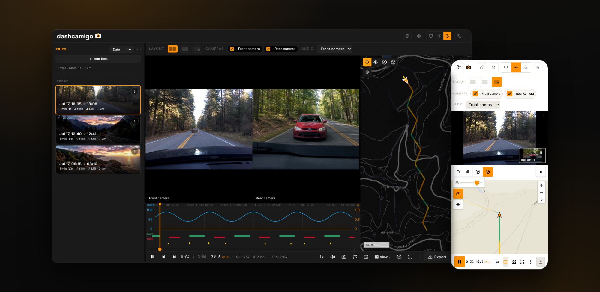

# dashcamigo - dashcam player in your browser

[](https://dashcamigo.app)
[](https://beta.dashcamigo.app)

dashcamigo plays the recordings straight off a dashcam's SD card, entirely in
the browser. Point it at the card's folder and the clips become trips:
continuous playback across file boundaries, the route on a map, a speed and
G-force chart. Select a range and export it as MP4 - lossless stream-copy, or
re-encoded with speed, map and G-force overlays burned into the frame. Think
of it as the desktop viewer that came with your camera, except it covers
dozens of brands, installs nothing and uploads nothing.

There is no backend. Recordings are read locally through the File API and
never leave the machine. On the hosted app the only network traffic is map
tiles and anonymized opt-out analytics
([privacy](https://dashcamigo.app/privacy)); a self-hosted build has no
analytics at all unless you configure it.

[Open the app](https://dashcamigo.app) | [Supported cameras](#supported-cameras) | [Self-hosting](#self-hosting) | [Contributing](CONTRIBUTING.md) | [License](#license)

<p align="center">
  <a href="https://dashcamigo.app">
    
  </a>
</p>

## Features

- **Everything in sync:** the route is colored by speed, a marker follows
  playback, and hovering the chart or the route seeks all three.
- **Event detection:** harsh braking is detected from the G-force data and
  marked on the chart.
- **Flexible export:** crop, cameras side by side, a watermark; GPS embedded
  into the MP4 or saved as GPX.
- **Plate & face blur:** drawn by hand or auto-detected (beta), tracked as
  they move, applied on export - on-device, like everything else.
- **Runs everywhere:** desktop and mobile, 10 languages, offline after the
  first visit.

## Supported cameras

Every GPS parser is built from a real recording or a verified open-source
reference, never from guesswork. Coverage includes 70mai, VIOFO, GoPro,
Garmin, Thinkware, BlackVue, Vantrue, Nextbase and more; the full list lives
in [docs/gps-format-coverage.md](docs/gps-format-coverage.md).

A camera that is not covered still plays and groups into trips - only the
route and the chart are missing. As a stopgap, drop a GPS track next to a
clip as `<basename>.gpx` (from a phone app or an external logger; some
cameras write one themselves) and it is picked up automatically.

Want your camera supported properly? Two ways:

- In the app: package the card's file list (file names only, never the video)
  into a report you can send - see
  [dashcamigo.app/add-my-camera](https://dashcamigo.app/add-my-camera).
- On GitHub: open a camera-support issue - the template walks through what to
  include. Never attach a real recording to a public issue; we will follow up
  on how to share a sample privately.

## Development

```sh
npm install
npm run dev
```

Node 22. A fresh clone builds and runs with no keys, no accounts and no
environment variables. Feedback, ideas and camera requests go through GitHub
issues - see [CONTRIBUTING.md](CONTRIBUTING.md).

## Self-hosting

The production build is plain static files - any static server can host it,
and a self-hosted build contacts nothing except the map tiles. Two ways to
run your own copy:

**Have Node.js?** One line downloads the latest build into a `dashcamigo`
folder next to you and serves it. macOS / Linux:

```sh
curl -fsSL https://github.com/amkulikov/dashcamigo/releases/latest/download/dashcamigo.tar.gz | tar -xz && npx serve dashcamigo
```

Windows (PowerShell):

```powershell
curl.exe -fsSL https://github.com/amkulikov/dashcamigo/releases/latest/download/dashcamigo.tar.gz -o dashcamigo.tar.gz; tar -xzf dashcamigo.tar.gz; npx serve dashcamigo
```

Building from a clone instead: `npm ci && npm run build && npx serve dist`.

**No Node.js?** One line runs the prebuilt image - same on Windows, macOS
and Linux:

```sh
docker run -d -p 8080:80 ghcr.io/amkulikov/dashcamigo
```

Then open http://localhost:8080. Building the image from a clone instead:
`docker build -t dashcamigo . && docker run -d -p 8080:80 dashcamigo`.

Already running a web server (nginx, Caddy, a NAS)? Drop the unzipped files
into its root. Serving rules, the HTTPS/localhost caveat for the editor
features, and the reference nginx config:
[docs/self-hosting.md](docs/self-hosting.md).

Just want the app to work offline? Installing
[dashcamigo.app](https://dashcamigo.app) as an app from the browser does that
with no setup at all.

## Built with

- [Mediabunny](https://github.com/Vanilagy/mediabunny) - reads and writes the
  video files: playback plumbing and MP4 export
- [MapLibre GL JS](https://github.com/maplibre/maplibre-gl-js) - the route map
- [Chart.js](https://github.com/chartjs/Chart.js) - the speed and G-force chart
- [ONNX Runtime](https://github.com/microsoft/onnxruntime) - on-device inference
  for the license-plate and face blur, tracking the object as it moves
- [OpenFreeMap](https://openfreemap.org) - keyless vector map tiles

## License

[AGPL-3.0-only](LICENSE). In plain terms:

- Use it, modify it and self-host it freely.
- If you run a modified version for others to use over a network, you must
  offer them that version's complete source under the same license.
- Like any free software, it comes with no warranty of any kind and no
  liability for any damages.

This is a summary, not legal advice - [LICENSE](LICENSE) is the binding text.

The **dashcamigo** name, logo and brand mark are not covered by the code
license and may not be used to identify a fork or a rehosted instance.
