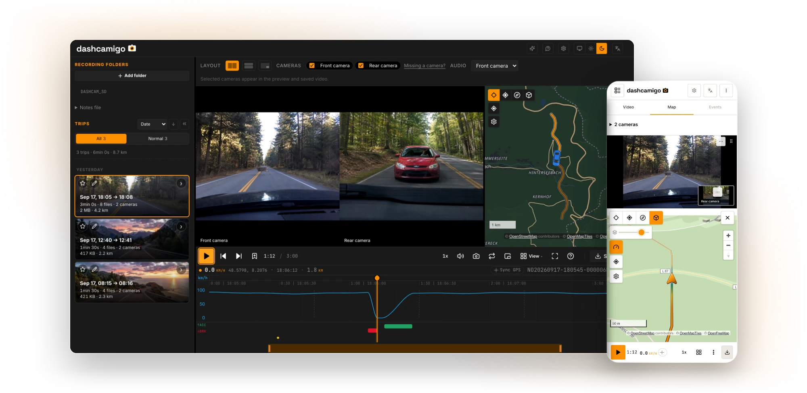

# dashcamigo - dashcam player in your browser

<p>
  <a href="https://dashcamigo.app"><kbd>&nbsp;&nbsp;dashcamigo.app&nbsp;&nbsp;</kbd></a>&ensp;
  <a href="https://gh.dashcamigo.app"><kbd>&nbsp;gh.dashcamigo.app · mirror&nbsp;</kbd></a>&ensp;
  <a href="https://beta.dashcamigo.app"><kbd>&nbsp;beta.dashcamigo.app&nbsp;</kbd></a>
</p>

<p align="center">
  <a href="https://dashcamigo.app">
    
  </a>
</p>

dashcamigo plays the recordings straight off a dashcam's SD card, entirely in
the browser. Point it at the card's folder and the clips become trips:
playback continues across file boundaries, and the route shows on a map
alongside a speed and G-force chart. Select a range and export it as MP4 -
lossless stream-copy, or re-encoded with speed, map and G-force overlays
burned into the frame. Think of it as the desktop viewer that came with your
camera, except it covers dozens of brands.

There is no backend. Recordings are read locally through the File API and
never leave the machine. On the hosted app the only network traffic is map
tiles and anonymized opt-out analytics
([privacy](https://dashcamigo.app/privacy)); a self-hosted build has no
analytics at all unless you configure it.

[Supported cameras](#supported-cameras) | [Self-hosting](#self-hosting) | [Contributing](CONTRIBUTING.md) | [License](#license)

## Getting started

- [**dashcamigo.app**](https://dashcamigo.app) - the app, latest release.
- [**gh.dashcamigo.app**](https://gh.dashcamigo.app) - the same release served
  from GitHub Pages, for when the main domain is unreachable.
- [**beta.dashcamigo.app**](https://beta.dashcamigo.app) - the upcoming
  version, updated on every push to `main`.
- **Install it** - any of the domains installs as an app straight from the
  browser; after that it opens with no network at all.
- [**Self-host it**](#self-hosting) - plain static files: one command with
  Node or Docker.

## Features

- **Sync:** the route is colored by speed and a marker follows playback;
  hovering the chart or the route seeks all three at once.
- **Events:** harsh braking is detected from the G-force data and marked on
  the chart.
- **Export:** crop, side-by-side cameras, a watermark, GPS embedded into the
  MP4 or saved as GPX.
- **Blur:** plates and faces - drawn by hand or auto-detected (beta), then
  tracked as they move and applied on export. On-device, like everything
  else.
- **Platforms:** desktop and mobile, in 10 languages; works offline after
  the first visit.
- **Browsers:** viewing works in any current browser; re-encoded export
  needs WebCodecs and the map needs WebGL2 - the exact boundary is in
  [docs/browser-support.md](docs/browser-support.md).

## Supported cameras

Every GPS parser is built from a real recording or a verified open-source
reference. Coverage includes 70mai, VIOFO, GoPro,
Garmin, Thinkware, BlackVue, Vantrue, Nextbase and more; the full list lives
in [docs/gps-format-coverage.md](docs/gps-format-coverage.md).

Want your camera supported properly? Two ways:

- In the app: package the card's file list
  into a report you can send - see
  [dashcamigo.app/add-my-camera](https://dashcamigo.app/add-my-camera).
- On GitHub: open a camera-support issue.

## Self-hosting

The production build is plain static files - any static server can host it,
and a self-hosted build contacts nothing except the map tiles.

With Node.js, one line downloads the latest build and serves it.
Windows (PowerShell):

```powershell
curl.exe -fsSL https://github.com/amkulikov/dashcamigo/releases/latest/download/dashcamigo.tar.gz -o dashcamigo.tar.gz; tar -xzf dashcamigo.tar.gz; npx serve dashcamigo
```

macOS / Linux:

```sh
curl -fsSL https://github.com/amkulikov/dashcamigo/releases/latest/download/dashcamigo.tar.gz | tar -xz && npx serve dashcamigo
```

With Docker, nothing else required:

```sh
docker run -d -p 8080:80 ghcr.io/amkulikov/dashcamigo
```

Then open http://localhost:8080.

## Built with

- [Mediabunny](https://github.com/Vanilagy/mediabunny) - reads and writes the
  video files: playback plumbing and MP4 export
- [MapLibre GL JS](https://github.com/maplibre/maplibre-gl-js) - the route map
- [Chart.js](https://github.com/chartjs/Chart.js) - the speed and G-force chart
- [ONNX Runtime](https://github.com/microsoft/onnxruntime) - on-device inference
  for the license-plate and face blur
- [OpenFreeMap](https://openfreemap.org) - keyless vector map tiles

## License

[AGPL-3.0-only](LICENSE). In plain terms:

- Use it, modify it and self-host it freely.
- If you run a modified version for others to use over a network, you must
  offer them that version's complete source under the same license.
- Like any free software, it comes with no warranty of any kind and no
  liability for any damages.

This is a summary, not legal advice - [LICENSE](LICENSE) is the binding text.

The **dashcamigo** name, logo and brand mark are not covered by the code
license and may not be used to identify a fork or a rehosted instance.
